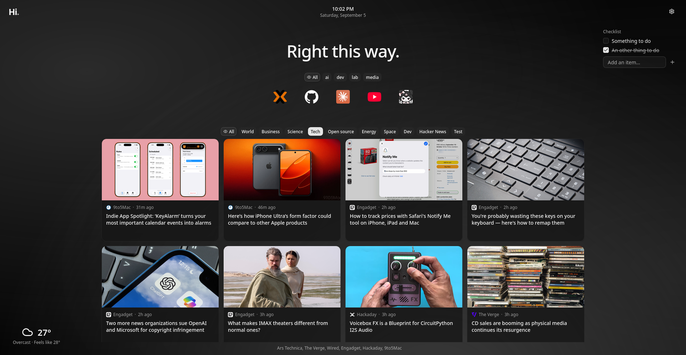
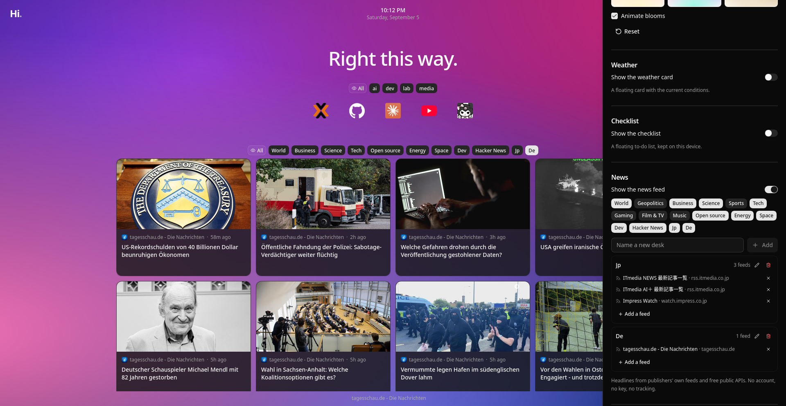

<div align="center">

# Hi.

**Your favorite sites in place of the new tab page.**

Every new tab becomes a page that is yours: the sites you actually open, your own wallpaper, the weather where you are, a short checklist and the news you follow and nothing else.

[](https://react.dev/)
[](https://www.typescriptlang.org/)
[](https://vite.dev/)
[](https://tailwindcss.com/)
[](#-license)

[](#-install)
[](#-install)
[](#-privacy)

<!-- When the listings go live, swap the two badges above for:
[](https://addons.mozilla.org/firefox/addon/<slug>/)
[](https://chromewebstore.google.com/detail/<id>)
and point the "Install" links at the same URLs. -->

Works in **Firefox**, **Chrome** and **Edge**.

</div>

---

## 📑 Table of Contents

- [Overview](#-overview)
- [Screenshots](#-screenshots)
- [Features](#-features)
- [Install](#-install)
- [Privacy](#-privacy)
- [Tech Stack](#-tech-stack)
- [Development](#-development)
- [License](#-license)

---

## 🔎 Overview

The default new tab page is either blank or full of things somebody else chose for you. **Hi.** replaces it with a page you arrange once and then just use.

At the centre is a board of your sites add a link and it picks up the site's own icon, give it tags, drag the bubbles into the order you like. Around it you turn on only what you want: a clock and a greeting, the current weather, a small checklist, a news feed built from the sources you pick. Behind it all sits a wallpaper: one of the built-in gradients, one you mix yourself, or a photo or video of your own.

Everything stays on your machine. There is no account to create and nothing to sign in to open a new tab and it is already there, even offline. When you move to another browser or another computer, you export your setup to a single file and import it on the other side.

---

## 📸 Screenshots

<div align="center">



*Your sites, your news, the weather and the checklist, on your own wallpaper.*

<br>



*Settings: turn modules on or off, mix a wallpaper, build news desks from any RSS feed.*

</div>

---

## ✨ Features

| Module                  | Description                                                                                     |
| ----------------------- | ----------------------------------------------------------------------------------------------- |
| 🗂 **Your sites**       | Add a link and it finds the icon on its own, or set your own then tag, reorder and hide freely |
| 🎨 **Your wallpaper**   | Ready-made gradients, a gradient you mix yourself, or your own image or video with fit and effects |
| 🌤 **Weather**          | Current conditions where you are, or in any city you name no account, no API key               |
| ✅ **Checklist**        | A few things to do, parked in whichever corner suits you                                         |
| 📰 **News**             | Desks of headlines from a curated list of publishers, or any RSS feed you add save what you want to read later |
| 🕐 **Clock & greeting** | The time, and a different hello on every tab                                                    |
| 🌗 **Light & dark**     | Follows your system, or stays on the one you prefer with no white flash on a dark setup        |
| 💾 **Take it with you** | Your whole setup exports to one file and imports on another browser or machine                   |

---

## 📦 Install

The extension is not published yet. The store links will land here as soon as the listings are live:

| Browser              | Where                                    |
| -------------------- | ---------------------------------------- |
| **Firefox**          | *coming soon Firefox Add-ons*          |
| **Chrome** / **Edge** | *coming soon Chrome Web Store*         |

Once installed, it takes over the new tab page straight away: every `Ctrl+T` opens your board, with the caret already in the address bar.

Until then, you can build it and load it yourself see [`BUILD.md`](./BUILD.md).

---

## 🔒 Privacy

- **No account, no server, no analytics.** Nothing about you is collected or sent anywhere.
- **Your setup stays local.** Sites, settings and uploaded wallpapers live in your browser's own storage, and leave it only when *you* export them to a file.
- **The news feed is off until you turn it on.** When you do, the browser asks your permission for each source, one site at a time, and the extension does one thing with it: fetch that feed. It never reads the pages you browse.
- **Weather is looked up without identifying you.** No key, no account, and the location is either the one your browser offers or the city you typed.

---

## 🛠 Tech Stack

| Area            | Technologies                                                                                            |
| --------------- | ------------------------------------------------------------------------------------------------------- |
| **UI**          | [React 19](https://react.dev/), [shadcn/ui](https://ui.shadcn.com/) + [Radix UI](https://www.radix-ui.com/) |
| **Build tool**  | [Vite 7](https://vite.dev/)                                                                             |
| **Language**    | [TypeScript 5.9](https://www.typescriptlang.org/)                                                       |
| **Styling**     | [Tailwind CSS 4](https://tailwindcss.com/), [tw-animate-css](https://github.com/Wombosvideo/tw-animate-css) |
| **State**       | [Zustand 5](https://zustand.docs.pmnd.rs/) with `persist`                                               |
| **Icons**       | [Lucide](https://lucide.dev/)                                                                           |
| **Interaction** | [dnd kit](https://dndkit.com/), [Sonner](https://sonner.emilkowal.ski/), [next-themes](https://github.com/pacocoursey/next-themes) |
| **Linting**     | [ESLint 9](https://eslint.org/) + [typescript-eslint](https://typescript-eslint.io/)                    |
| **Packaging**   | [Manifest V3](https://developer.chrome.com/docs/extensions/develop/migrate) (Firefox, Chrome, Edge)     |
| **Storage**     | `localStorage` for settings, IndexedDB for uploaded wallpapers                                          |
| **Data**        | Weather from [Open-Meteo](https://open-meteo.com/), news from publishers' own RSS feeds                 |

---

## 💻 Development

```bash
npm install
npm run dev
```

Build steps, project structure, storage notes and the source-review notes for Mozilla are in [`BUILD.md`](./BUILD.md).

---

## 📄 License

Released under the **MIT** License. See the [`LICENSE`](./LICENSE) file for details.

---

<div align="center">

created by **[Carla Deafiaa](https://github.com/Aidesu)**

</div>
